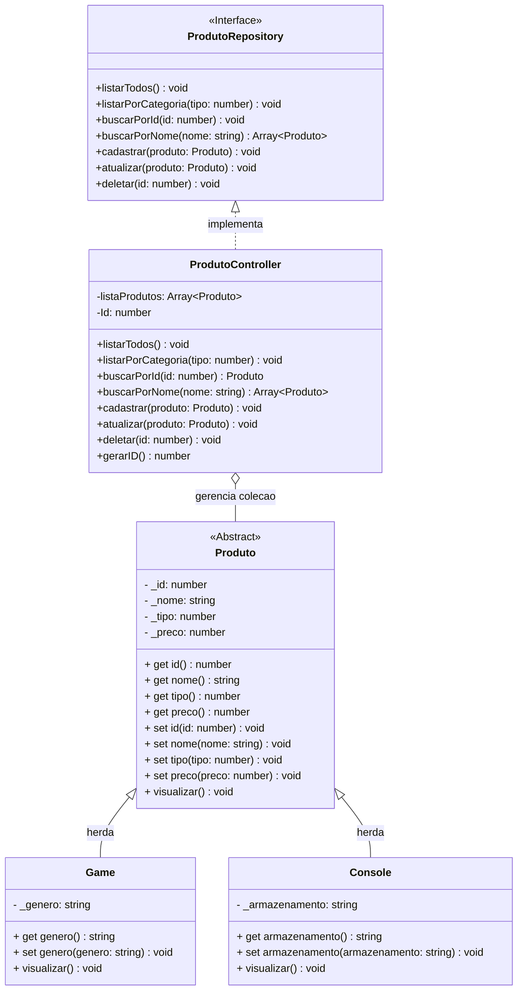
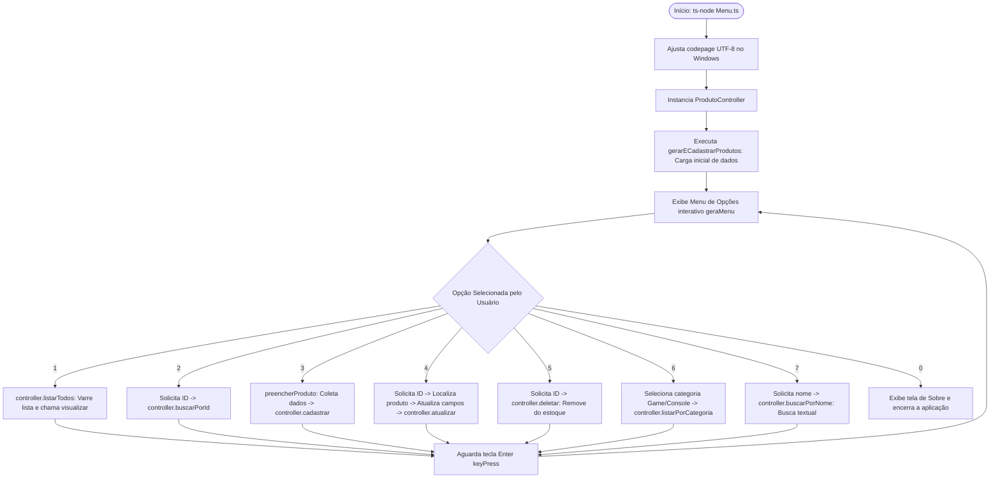

# Projeto Loja de Games - TypeScript & POO

## Sistema de Gerenciamento de E-commerce de Jogos | Portfólio Profissional

<br />

<details open>
  <summary><strong>🎮 Logotipo / Identidade Visual do Projeto</strong></summary>

  <br />

  <div align="center">
    
  </div>

</details>

<br />

<div align="center">

[](https://www.typescriptlang.org/)
[](https://nodejs.org/)
[](#competências-técnicas-demonstradas)
[](https://www.npmjs.com/package/readline-sync)
[](LICENSE)
[](#)

</div>

<br />

<div align="center">
  
  
  
  
  
  
  
</div>

------

<br />

O **Projeto Loja de Games** é uma aplicação **educacional** desenvolvida em **TypeScript**, com foco em **Programação Orientada a Objetos (POO)** e **arquitetura modular**, simulando o backend de um e-commerce através de um **CRUD de Jogos e Consoles**.

**Objetivo:** Demonstrar **organização, domínio técnico, modelagem de domínio e boas práticas de engenharia de software** em um case prático de portfólio.

<br />

> [!WARNING]
>
> Este projeto possui **fins educacionais** e **não representa um e-commerce real com transações financeiras**. Foi desenvolvido para **aprendizado, demonstração técnica e portfólio profissional**.

<br />

Este projeto foi estruturado para:

- Demonstrar **competência técnica em TypeScript**
- Aplicar **POO em um cenário realista** (Herança, Abstração e Polimorfismo)
- Evidenciar **arquitetura limpa e organização de código**
- Simular **regras de negócio de um varejo de games**
- Servir como **case técnico para recrutadores**

<br />

## Competências Técnicas Demonstradas

- Programação Orientada a Objetos (Abstração, Encapsulamento, Herança, Polimorfismo)
- Modelagem de domínio orientada a objetos
- Arquitetura em camadas (**Model, Repository, Controller**)
- Tipagem forte com **TypeScript**
- Uso de **Interfaces** para contratos de repositório
- Separação de responsabilidades e tratamento de dados em Collections (Arrays)
- Validação de entradas e controle de fluxo via CLI

<br />

## 🎯 Diferenciais e Destaques Técnicos

- **Abstração e Contratos Estritos com Interfaces:** Aplicação do *Repository Pattern* através da interface `ProdutoRepository`, desacoplando completamente as operações de persistência em memória da interface de terminal (`Menu.ts`).
- **Polimorfismo e Reutilização de Código:** A classe base abstrata `Produto` centraliza atributos universais (`id`, `nome`, `tipo`, `preco`) e a rotina de exibição `visualizar()`. As classes derivadas `Game` e `Console` reutilizam o comportamento ancestral via `super.visualizar()` e injetam dados especializados (`genero` e `armazenamento`).
- **Encapsulamento Rigoroso:** Propriedades de entidades protegidas com modificadores de acesso privados (`private _nome`, etc.) e expostas por meio de *Getters* e *Setters* tipados, garantindo a integridade dos dados em tempo de execução.
- **Formatação de Moeda Brasileira (i18n):** Módulo utilitário `CurrencyBr.ts` que utiliza a API nativa `Intl.NumberFormat('pt-BR', { style: 'currency', currency: 'BRL' })` para formatação monetária padronizada em todos os fluxos.
- **Automação de Dados de Teste (Seed):** Função `gerarECadastrarProdutos()` que popula a base em memória com 11 produtos diversificados (consoles como PS5, Xbox Series e jogos de destaque), facilitando a homologação imediata de todas as funcionalidades.

<br />

## Impacto Técnico e Métricas

| Indicador                     | Valor                         |
| ----------------------------- | ----------------------------- |
| Linhas de código              | +600                          |
| Classes principais            | 4 (Produto, Game, Console, ProdutoController) |
| Interface de Repositório      | 1 (ProdutoRepository)         |
| Operações de Gestão           | 7 (Criar, Listar Todos, Buscar ID, Atualizar, Deletar, Filtrar Categoria, Buscar Nome) |
| Conceitos POO aplicados       | 6+ (Abstração, Herança, Polimorfismo, Encapsulamento, Interfaces, Tipagem Genérica) |
| Camadas arquiteturais         | Model, Repository, Controller, Util, CLI View |
| Persistência                  | Simulada em memória (Array tipado `Array<Produto>`) |
| Complexidade lógica           | Média-Alta                    |
| Uso educacional               | ✅                            |

<br />

## Funcionalidades do Projeto

| Funcionalidade                     | Status | Descrição Técnica |
| ---------------------------------- | :----: | ----------------- |
| Cadastro de Jogos e Consoles       | ✅      | Instanciação tipada de `Game` ou `Console` com geração incremental de ID |
| Listagem completa de produtos      | ✅      | Varredura e renderização polimórfica de todo o catálogo em memória |
| Consulta de produto por ID         | ✅      | Busca binária/linear via `Array.find()` com tratamento de ID inexistente |
| Atualização de dados de produtos   | ✅      | Edição interativa de atributos com preservação de valores anteriores |
| Exclusão de produtos do estoque    | ✅      | Remoção segura via `Array.splice()` com exibição do item excluído |
| Diferenciação por Categoria/Tipo   | ✅      | Segmentação por tipo (`1 - Game` ou `2 - Console`) |
| Listagem Filtrada por Categoria    | ✅      | Filtro dinâmico via `Array.filter()` por tipo de produto |
| Busca de Produtos por Nome         | ✅      | Busca textual case-insensitive via `toLowerCase().includes()` |
| Interface CLI interativa (Menu)    | ✅      | Menu visual de console com cores e tratamento de codepage UTF-8 (Windows/Linux) |

<br />

## Diagrama de Classes e Arquitetura

O diagrama abaixo ilustra a hierarquia de classes, a interface de repositório e a controladora responsável pelas operações de negócio:



<br />

## 🔄 Fluxo de Execução e Ciclo de Vida da Aplicação



<br />

## Arquitetura do Projeto

Estrutura organizada para facilitar **manutenção, escalabilidade e leitura técnica**:

```text
📦 projeto_final_bloco_01
 ┣ 📂 .vscode          # Configurações de depuração no VS Code (launch.json)
 ┣ 📂 src
 ┃ ┣ 📂 controller     # Implementação da lógica de negócio (ProdutoController)
 ┃ ┣ 📂 model          # Entidades (Produto, Game, Console)
 ┃ ┣ 📂 repository     # Interface do CRUD (ProdutoRepository)
 ┃ ┗ 📂 util           # Cores e utilitários de formatação monetária (CurrencyBr)
 ┣ 📜 Menu.ts          # Ponto de entrada (Interface CLI com o usuário)
 ┣ 📜 package.json     # Manifesto e dependências de execução
 ┗ 📜 tsconfig.json    # Configurações do compilador TypeScript
```

### Detalhamento das Camadas e Responsabilidades

* **Camada Model (`src/model/`):**
  * `Produto.ts`: Classe abstrata fundamental. Define os campos protegidos de identificação, nome, classificação de tipo e preço, encapsulando-os com métodos de acesso.
  * `Game.ts`: Especialização de produto voltada a softwares de entretenimento, adicionando a propriedade de gênero textual (RPG, Aventura, etc.).
  * `Console.ts`: Especialização voltada a hardware de jogos, agregando capacidade de armazenamento (512GB, 1TB SSD, etc.).
* **Camada Repository (`src/repository/`):**
  * `ProdutoRepository.ts`: Interface formal do contrato de dados. Garante que qualquer implementação de armazenamento (em memória, SQL, NoSQL) respeite a assinatura esperada pela aplicação.
* **Camada Controller (`src/controller/`):**
  * `ProdutoController.ts`: Centraliza a manipulação do array de produtos, gerando chaves primárias sequenciais (`gerarID()`) e executando operações de busca, filtragem e atualização com proteção contra mutações indevidas.
* **Camada Util (`src/util/`):**
  * `CurrencyBr.ts`: Função utilitária de internacionalização com `Intl.NumberFormat`, convertendo valores de ponto flutuante em formato de Real brasileiro (`R$ 0.000,00`).
* **Camada View / Ponto de Entrada (`Menu.ts`):**
  * Gerencia o loop interativo via terminal (`readline-sync`), formata tabelas visuais e mapeia as opções do menu para chamadas nos métodos da controller.

<br />

## 🎯 Padrões de Projeto e Práticas de Engenharia Implementadas

* **Princípio da Responsabilidade Única (SRP):** Cada classe possui um propósito estritamente delimitado. `Menu.ts` cuida da interface e entrada do usuário; `ProdutoController` orquestra a lógica de coleção; os modelos cuidam da representação do domínio.
* **Princípio de Substituição de Liskov (LSP):** Objetos das classes `Game` e `Console` podem ser tratados indistintamente como instâncias de `Produto` dentro do array `listaProdutos`, garantindo que o método polimórfico `visualizar()` funcione de forma homogênea.
* **Programação Orientada a Interfaces:** A controller implementa a interface `ProdutoRepository`, promovendo baixo acoplamento e facilitando futuras migrações de persistência para bancos relacionais (MySQL, PostgreSQL) ou MongoDB.
* **Defensive Programming & Fail-Safe Defaults:** A função `preencherProduto()` valida seleções do usuário e retorna `Produto | null`, prevenindo inserções inconsistentes no repositório.

<br />

## Tecnologias Utilizadas

- **Linguagem & Runtime**
  - **TypeScript (v5+):** Linguagem fortemente tipada para JavaScript, permitindo contratos estritos, herança e checagem estática de tipos.
  - **Node.js:** Ambiente de execução JavaScript assíncrono orientado a eventos para o backend e CLI.
  - **ts-node:** Mecanismo de execução direta de arquivos TypeScript sem necessidade de etapa prévia manual de transpilação.
  - **readline-sync:** Biblioteca síncrona para captura interativa de inputs no terminal com suporte a menus e opções estruturadas.

- **Ferramentas & Qualidade**
  - **Git & GitHub:** Versionamento distribuído com controle semântico de branches e commits.
  - **Mermaid:** Ferramenta baseada em Markdown para geração dinâmica de diagramas de classes e fluxogramas.
  - **VS Code Debugger:** Configurações no `.vscode/launch.json` para inspeção e depuração passo a passo de scripts TypeScript.

<br />

## 💻 Exemplos de Código

Abaixo estão trechos representativos da arquitetura orientada a objetos implementada:

### 1. Polimorfismo e Herança (`src/model/Game.ts`)
```typescript
import Produto from "./Produto";

export default class Game extends Produto {
    private _genero: string;

    constructor(id: number, nome: string, preco: number, genero: string) {
        super(id, nome, 1, preco);
        this._genero = genero;
    }

    public get genero(): string {
        return this._genero;
    }

    public set genero(value: string) {
        this._genero = value;
    }

    public visualizar(): void {
        super.visualizar();
        console.log(`   Gênero: ${this.genero}`);
        console.log(`***************************** \n`);
    }
}
```

### 2. Implementação do Contrato de Repositório (`src/controller/ProdutoController.ts`)
```typescript
import Produto from "../model/Produto";
import ProdutoRepository from "../repository/ProdutoRepository";

export default class ProdutoController implements ProdutoRepository {
    private listaProdutos = new Array<Produto>();
    private Id = 0;

    listarPorCategoria(tipo: number): void {
        const listagem = this.listaProdutos.filter(prod => prod.tipo === tipo);
        if (listagem.length > 0) {
            listagem.forEach(prod => prod.visualizar());
        } else {
            console.log(" Não existem produtos cadastrados para essa categoria. ");
        }
    }

    buscarPorNome(nome: string): Array<Produto> {
        return this.listaProdutos.filter(prod => 
            prod.nome.toLowerCase().includes(nome.toLowerCase())
        );
    }

    public gerarID(): number {
        return ++this.Id;
    }
}
```

### 3. Formatação Monetária com `Intl.NumberFormat` (`src/util/CurrencyBr.ts`)
```typescript
export const currencyBr = (value: number) => 
    new Intl.NumberFormat("pt-BR", {
        style: "currency",
        currency: "BRL"
    }).format(value);
```

<br />

## Como Executar

**1️⃣ Clone o repositório**

```bash
git clone https://github.com/erickystn/projeto_final_bloco_01
```

**2️⃣ Acesse a pasta do projeto via terminal**

```bash
cd projeto_final_bloco_01
```

**3️⃣ Instale as dependências**

```bash
npm install
```

**4️⃣ Execute a aplicação**

```bash
ts-node Menu.ts
```

> **Dica de Compilação (Build para JavaScript):**
> Caso deseje compilar os arquivos TypeScript para a pasta de distribuição, execute:
> ```bash
> npx tsc
> ```

<br />

## Implementações Futuras

- [ ] Persistência com banco de dados relacional (PostgreSQL / MySQL via TypeORM ou Prisma)
- [ ] Testes unitários automatizados com Jest cobrindo a controller e validações
- [ ] API RESTful com NestJS aproveitando as classes de domínio já modeladas
- [ ] Interface Web moderna em React ou Angular consumindo a API
- [ ] Containerização da aplicação com Docker e Docker Compose
- [ ] Pipeline de CI/CD automatizado via GitHub Actions para lint e build

<br />

## Contribuições

Sugestões, melhorias e pull requests são bem-vindos.

Você pode contribuir com:

- Melhorias arquiteturais
- Refatorações
- Testes automatizados
- Documentação

<br />

## Licença

Este projeto está sob licença **MIT** — livre para uso educacional e profissional.

<br />

## Autor

**Ericky — Desenvolvedor Full Stack**

🔗 **GitHub:** https://github.com/erickystn

🔗 **LinkedIn:** https://www.linkedin.com/in/erickystn

Projeto desenvolvido para **aprendizado contínuo**, **demonstração técnica** e **portfólio profissional**.
